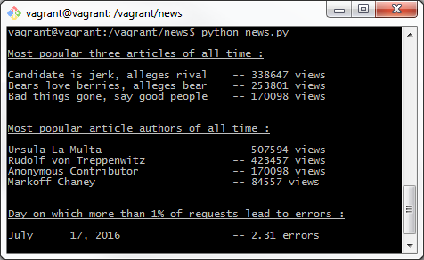

# Udacity LogAnalysis Project
## Project Description
Python command line reporting tool that displays 3 successive set of reports.
1. What are the most popular three articles of all time?
2. Who are the most popular article authors of all time?
3. On which days did more than 1% of requests lead to errors?

# Basic Setup
1. Create two views in the 'news database' ([views](#views-creation)) 
2. Run the program using the command line
	python news.py 
3. Tadaaaaa

## Views Creation
	create view log_errors as select  date_trunc('day',time) as time, count(*) as requests from log  where status!='200 OK' group by 1;
	create view log_success as select  date_trunc('day',time) as time, count(*) as requests from log  where status='200 OK' group by 1;

## Questions

Having a problem getting something to work or want to know more ? Ping me on Twitter [@ymedaghri](https://twitter.com/ymedaghri) or file a [GitHub Issue](https://github.com/ymedaghri/python-trailers/issues/new).
 

